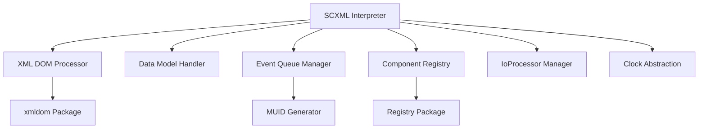

# SCXML Package W3C Specification Compliance Design

## Overview

This document outlines the design for implementing a State Chart XML (SCXML) interpreter in Go that adheres to the W3C SCXML specification. The implementation will leverage the existing xmldom package for XML processing and integrate with the registry and muid packages for component management and unique ID generation.

The SCXML interpreter will provide a complete implementation of the W3C recommendation, enabling the creation and execution of hierarchical state machines with features such as parallel states, history states, and data models.

## Architecture

### System Components

The SCXML implementation consists of several core components:

1. **XML Parser/Processor** - Uses the xmldom package for parsing and manipulating SCXML documents
2. **State Machine Interpreter** - Core engine that executes SCXML state machines according to the W3C algorithm
3. **Data Model** - Handles data manipulation within the state machine (supporting null and ECMAScript models)
4. **Event System** - Manages internal and external events using MUID for unique identification
5. **Component Registry** - Uses the registry package for managing pluggable components
6. **IoProcessors** - Handles communication with external systems
7. **Clock Abstraction** - Provides deterministic time handling for testing

### Component Diagram



## Implementation Details

### XML Processing with xmldom

The xmldom package provides the foundation for XML processing in the SCXML implementation:

- Parse SCXML documents into DOM structures
- Navigate and manipulate XML elements and attributes
- Validate SCXML document structure
- Support for namespaces and XML Schema validation

### State Machine Core

The interpreter.go file will contain the main SCXML interpreter implementation that follows the W3C algorithm specification exactly.

### Data Models

Support for multiple data models:

- Null data model (minimal implementation)
- ECMAScript data model (full scripting support)

### Event Handling

Events are managed through:

- External event queue (blocking)
- Internal event queue (non-blocking)
- MUID-based unique event identification
- Event name matching and filtering

### Component Registry Integration

The registry package is used for:

- IoProcessor registration and management
- Data model provider registration
- Custom action handler registration
- Extensible component architecture

## SCXML Algorithm Implementation

The SCXML interpreter will implement the exact algorithm specified in the W3C recommendation. The following pseudocode algorithms from the specification will be implemented:

### Main Interpretation Algorithm

```pseudocode
procedure interpret(doc):
    if not valid(doc): failWithError()
    expandScxmlSource(doc)
    configuration = new OrderedSet()
    statesToInvoke = new OrderedSet()
    internalQueue = new Queue()
    externalQueue = new BlockingQueue()
    historyValue = new HashTable()
    datamodel = new Datamodel(doc)
    if doc.binding == "early":
        initializeDatamodel(datamodel, doc)
    running = true
    executeGlobalScriptElement(doc)
    enterStates([doc.initial.transition])
    mainEventLoop()
```

### Main Event Loop

```pseudocode
procedure mainEventLoop():
    while running:
        enabledTransitions = null
        macrostepDone = false
        # Here we handle eventless transitions and transitions
        # triggered by internal events until macrostep is complete
        while running and not macrostepDone:
            enabledTransitions = selectEventlessTransitions()
            if enabledTransitions.isEmpty():
                if internalQueue.isEmpty():
                    macrostepDone = true
                else:
                    internalEvent = internalQueue.dequeue()
                    datamodel["_event"] = internalEvent
                    enabledTransitions = selectTransitions(internalEvent)
            if not enabledTransitions.isEmpty():
                microstep(enabledTransitions.toList())
        # either we're in a final state, and we break out of the loop
        if not running:
            break
        # or we've completed a macrostep, so we start a new macrostep by waiting for an external event
        # Here we invoke whatever needs to be invoked. The implementation of 'invoke' is platform-specific
        for state in statesToInvoke.sort(entryOrder):
            for inv in state.invoke.sort(documentOrder):
                invoke(inv)
        statesToInvoke.clear()
        # Invoking may have raised internal error events and we iterate to handle them
        if not internalQueue.isEmpty():
            continue
        # A blocking wait for an external event.  Alternatively, if we have been invoked
        # our parent session also might cancel us.  The mechanism for this is platform specific,
        # but here we assume it's a special event we receive
        externalEvent = externalQueue.dequeue()
        if isCancelEvent(externalEvent):
            running = false
            continue
        datamodel["_event"] = externalEvent
        for state in configuration:
            for inv in state.invoke:
                if inv.invokeid == externalEvent.invokeid:
                    applyFinalize(inv, externalEvent)
                if inv.autoforward:
                    send(inv.id, externalEvent)
        enabledTransitions = selectTransitions(externalEvent)
        if not enabledTransitions.isEmpty():
            microstep(enabledTransitions.toList())
    # End of outer while running loop.  If we get here, we have reached a top-level final state or have been cancelled
    exitInterpreter()
```

### Exit Interpreter Procedure

```pseudocode
procedure exitInterpreter():
    statesToExit = configuration.toList().sort(exitOrder)
    for s in statesToExit:
        for content in s.onexit.sort(documentOrder):
            executeContent(content)
        for inv in s.invoke:
            cancelInvoke(inv)
        configuration.delete(s)
        if isFinalState(s) and isScxmlElement(s.parent):
            returnDoneEvent(s.donedata)
```

### Select Eventless Transitions

```pseudocode
function selectEventlessTransitions():
    enabledTransitions = new OrderedSet()
    atomicStates = configuration.toList().filter(isAtomicState).sort(documentOrder)
    for state in atomicStates:
        loop: for s in [state].append(getProperAncestors(state, null)):
            for t in s.transition.sort(documentOrder):
                if not t.event and conditionMatch(t):
                    enabledTransitions.add(t)
                    break loop
    enabledTransitions = removeConflictingTransitions(enabledTransitions)
    return enabledTransitions
```

### Select Transitions

```pseudocode
function selectTransitions(event):
    enabledTransitions = new OrderedSet()
    atomicStates = configuration.toList().filter(isAtomicState).sort(documentOrder)
    for state in atomicStates:
        loop: for s in [state].append(getProperAncestors(state, null)):
            for t in s.transition.sort(documentOrder):
                if t.event and nameMatch(t.event, event.name) and conditionMatch(t):
                    enabledTransitions.add(t)
                    break loop
    enabledTransitions = removeConflictingTransitions(enabledTransitions)
    return enabledTransitions
```

### Remove Conflicting Transitions

```pseudocode
function removeConflictingTransitions(enabledTransitions):
    filteredTransitions = new OrderedSet()
    //toList sorts the transitions in the order of the states that selected them
    for t1 in enabledTransitions.toList():
        t1Preempted = false
        transitionsToRemove = new OrderedSet()
        for t2 in filteredTransitions.toList():
            if computeExitSet([t1]).hasIntersection(computeExitSet([t2])):
                if isDescendant(t1.source, t2.source):
                    transitionsToRemove.add(t2)
                else:
                    t1Preempted = true
                    break
        if not t1Preempted:
            for t3 in transitionsToRemove.toList():
                filteredTransitions.delete(t3)
            filteredTransitions.add(t1)
    return filteredTransitions
```

### Microstep Procedure

```pseudocode
procedure microstep(enabledTransitions):
    exitStates(enabledTransitions)
    executeTransitionContent(enabledTransitions)
    enterStates(enabledTransitions)
```

### Exit States Procedure

```pseudocode
procedure exitStates(enabledTransitions):
    statesToExit = computeExitSet(enabledTransitions)
    for s in statesToExit:
        statesToInvoke.delete(s)
    statesToExit = statesToExit.toList().sort(exitOrder)
    for s in statesToExit:
        for h in s.history:
            if h.type == "deep":
                f = lambda s0: isAtomicState(s0) and isDescendant(s0,s)
            else:
                f = lambda s0: s0.parent == s
            historyValue[h.id] = configuration.toList().filter(f)
        for content in s.onexit.sort(documentOrder):
            executeContent(content)
        for inv in s.invoke:
            cancelInvoke(inv)
        configuration.delete(s)
```

### Compute Exit Set

```pseudocode
function computeExitSet(transitions)
    statesToExit = new OrderedSet
    for t in transitions:
        if t.target:
            domain = getTransitionDomain(t)
            for s in configuration:
                if isDescendant(s,domain):
                    statesToExit.add(s)
    return statesToExit
```

### Execute Transition Content

```pseudocode
procedure executeTransitionContent(enabledTransitions):
    for t in enabledTransitions:
        executeContent(t)
```

### Enter States Procedure

```pseudocode
procedure enterStates(enabledTransitions):
    statesToEnter = new OrderedSet()
    statesForDefaultEntry = new OrderedSet()
    // initialize the temporary table for default content in history states
    defaultHistoryContent = new HashTable()
    computeEntrySet(enabledTransitions, statesToEnter, statesForDefaultEntry, defaultHistoryContent)
    for s in statesToEnter.toList().sort(entryOrder):
        configuration.add(s)
        statesToInvoke.add(s)
        if binding == "late" and s.isFirstEntry:
            initializeDataModel(datamodel.s,doc.s)
            s.isFirstEntry = false
        for content in s.onentry.sort(documentOrder):
            executeContent(content)
        if statesForDefaultEntry.isMember(s):
            executeContent(s.initial.transition)
        if defaultHistoryContent[s.id]:
            executeContent(defaultHistoryContent[s.id])
        if isFinalState(s):
            if isSCXMLElement(s.parent):
                running = false
            else:
                parent = s.parent
                grandparent = parent.parent
                internalQueue.enqueue(new Event("done.state." + parent.id, s.donedata))
                if isParallelState(grandparent):
                    if getChildStates(grandparent).every(isInFinalState):
                        internalQueue.enqueue(new Event("done.state." + grandparent.id))
```

### Compute Entry Set

```pseudocode
procedure computeEntrySet(transitions, statesToEnter, statesForDefaultEntry, defaultHistoryContent)
    for t in transitions:
        for s in t.target:
            addDescendantStatesToEnter(s,statesToEnter,statesForDefaultEntry, defaultHistoryContent)
        ancestor = getTransitionDomain(t)
        for s in getEffectiveTargetStates(t)):
            addAncestorStatesToEnter(s, ancestor, statesToEnter, statesForDefaultEntry, defaultHistoryContent)
```

### Add Descendant States To Enter

```pseudocode
procedure addDescendantStatesToEnter(state,statesToEnter,statesForDefaultEntry, defaultHistoryContent):
    if isHistoryState(state):
        if historyValue[state.id]:
            for s in historyValue[state.id]:
                addDescendantStatesToEnter(s,statesToEnter,statesForDefaultEntry, defaultHistoryContent)
            for s in historyValue[state.id]:
                addAncestorStatesToEnter(s, state.parent, statesToEnter, statesForDefaultEntry, defaultHistoryContent)
        else:
            defaultHistoryContent[state.parent.id] = state.transition.content
            for s in state.transition.target:
                addDescendantStatesToEnter(s,statesToEnter,statesForDefaultEntry, defaultHistoryContent)
            for s in state.transition.target:
                addAncestorStatesToEnter(s, state.parent, statesToEnter, statesForDefaultEntry, defaultHistoryContent)
    else:
        statesToEnter.add(state)
        if isCompoundState(state):
            statesForDefaultEntry.add(state)
            for s in state.initial.transition.target:
                addDescendantStatesToEnter(s,statesToEnter,statesForDefaultEntry, defaultHistoryContent)
            for s in state.initial.transition.target:
                addAncestorStatesToEnter(s, state, statesToEnter, statesForDefaultEntry, defaultHistoryContent)
        else:
            if isParallelState(state):
                for child in getChildStates(state):
                    if not statesToEnter.some(lambda s: isDescendant(s,child)):
                        addDescendantStatesToEnter(child,statesToEnter,statesForDefaultEntry, defaultHistoryContent)
```

### Add Ancestor States To Enter

```pseudocode
procedure addAncestorStatesToEnter(state, ancestor, statesToEnter, statesForDefaultEntry, defaultHistoryContent)
    for anc in getProperAncestors(state,ancestor):
        statesToEnter.add(anc)
        if isParallelState(anc):
            for child in getChildStates(anc):
                if not statesToEnter.some(lambda s: isDescendant(s,child)):
                    addDescendantStatesToEnter(child,statesToEnter,statesForDefaultEntry, defaultHistoryContent)
```

### Is In Final State

```pseudocode
function isInFinalState(s):
    if isCompoundState(s):
        return getChildStates(s).some(lambda s: isFinalState(s) and configuration.isMember(s))
    elif isParallelState(s):
        return getChildStates(s).every(isInFinalState)
    else:
        return false
```

### Get Transition Domain

```pseudocode
function getTransitionDomain(t)
    tstates = getEffectiveTargetStates(t)
    if not tstates:
        return null
    elif t.type == "internal" and isCompoundState(t.source) and tstates.every(lambda s: isDescendant(s,t.source)):
        return t.source
    else:
        return findLCCA([t.source].append(tstates))
```

### Find LCCA (Least Common Compound Ancestor)

```pseudocode
function findLCCA(stateList):
    for anc in getProperAncestors(stateList.head(),null).filter(isCompoundStateOrScxmlElement):
        if stateList.tail().every(lambda s: isDescendant(s,anc)):
            return anc
```

### Get Effective Target States

```pseudocode
function getEffectiveTargetStates(transition)
    targets = new OrderedSet()
    for s in transition.target
        if isHistoryState(s):
            if historyValue[s.id]:
                targets.union(historyValue[s.id])
            else:
                targets.union(getEffectiveTargetStates(s.transition))
        else:
            targets.add(s)
    return targets
```

### Helper Functions

The implementation will also include the following helper functions as specified in the W3C SCXML algorithm:

1. `getProperAncestors(state1, state2)` - Returns the set of all ancestors of state1 in ancestry order
2. `isDescendant(state1, state2)` - Returns true if state1 is a descendant of state2
3. `getChildStates(state1)` - Returns a list containing all state, final, and parallel children of state1
4. `isAtomicState(state)` - Returns true if state is atomic (has no state, final, or parallel children)
5. `isHistoryState(state)` - Returns true if state is a history pseudo-state
6. `isCompoundState(state)` - Returns true if state is a compound state
7. `isParallelState(state)` - Returns true if state is a parallel state
8. `isFinalState(state)` - Returns true if state is a final state
9. `isSCXMLElement(state)` - Returns true if state is the SCXML element
10. `conditionMatch(transition)` - Evaluates the condition of a transition
11. `nameMatch(eventDescriptor, eventName)` - Matches event names according to SCXML specification

## Integration Points

### xmldom Package Integration

The SCXML interpreter will use the xmldom package for all XML processing needs:

- Parsing SCXML documents
- Navigating the document structure
- Manipulating XML elements and attributes
- Validating document structure

### Registry Package Integration

The registry package will be used for:

- Registering IoProcessors for external communication
- Managing data model implementations
- Handling custom action extensions
- Providing a pluggable architecture

### MUID Package Integration

MUID (Monotonically Unique IDs) will be used for:

- Generating unique event IDs
- Ensuring deterministic behavior in distributed systems
- Tracking event causality

## Testing Strategy

### Unit Testing

- Test each algorithm function independently
- Verify data model implementations
- Test event queue management
- Validate XML processing functions

### Integration Testing

- End-to-end state machine execution
- Event processing workflows
- Data model integration
- IoProcessor communication

### Compliance Testing

- W3C SCXML test suite implementation
- Standard SCXML document validation
- Interoperability testing

## Future Extensions

### Additional Data Models

- JavaScript data model
- Lua data model
- Custom data model support

### Advanced Features

- State machine visualization
- Debugging and monitoring tools
- Performance optimization
- Distributed state machine support
